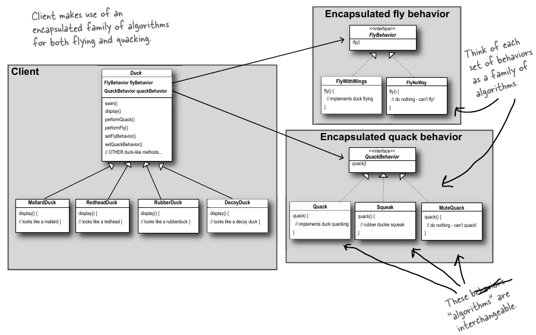

## When to use!
Whenever your want to define a new class that will have one behavior that is similar to other behaviors in a list. 
 ex. whether an animal can fly or not. 
Another thing that should trigger thinking about this pattern, 
is if you encounter a long list of conditionals, then maybe a Strategy Pattern is a good idea.
It's all about choosing between inheritance vs. composition, where the book favors composition over inheritance.

**In practice**, we end up with a field that uses a subclass of an interface, where the derivatives of the interface have defined one or more behavior-classes for that field. (see head-first for en example with ducks)

The only downside to this, is that you will encounter an increased amount of classes, since each different states of a field can expand indefinitely. 

## Design Principle
**Official Definition:**

* _The Strategy Pattern defines a family of algorithms, encapsulates each one, and makes them interchangeable.
 The Strategy Pattern lets the algorithm vary independently from clients that use it._

Which means identify the aspects of your application that vary and separate them from what stays the same, meaning: 
<em>Take the parts that vary and encapsulate them, so that later you can alter or extend the parts that vary without affecting those that don't.</em>

Something to think about, is that a class has a lot of fields and functionalities, where some changes more often than others.  
(Here it's up to you to decide when things changes too much, and a pattern needs to be implemented) 

Basically what we are doing with the Strategy Pattern and the like, 
is to extract some of those functionalities and fields into an encapsulated class, thus seperating
the things that changes alot from the things that are fairly static.   

## Strategy Pattern notes
Remember to avoid using interfaces that just forces the users to create a method, would cause a lot of code duplication.

This exercise is creating private classes in the interface class "Flies",
since by doing it that way, we can expand the private classes without affecting the other classes using it.

This is called composition, where instead of inheriting behavior, they are being composed by the right behavior objects.      

Behaviors can be changed at runtime, by using another derivative of the same Interface-type which the field is using.

Ideally, the behavior interface is connected to your implementations own interface and since inherited and defined in the constructor,
but in reality you would most likely end up only calling it in your implementation, since a lot of firms have an aversion of doing things the hard but right way. :P   

From Head First Design Patterns - Strategy Pattern UML.